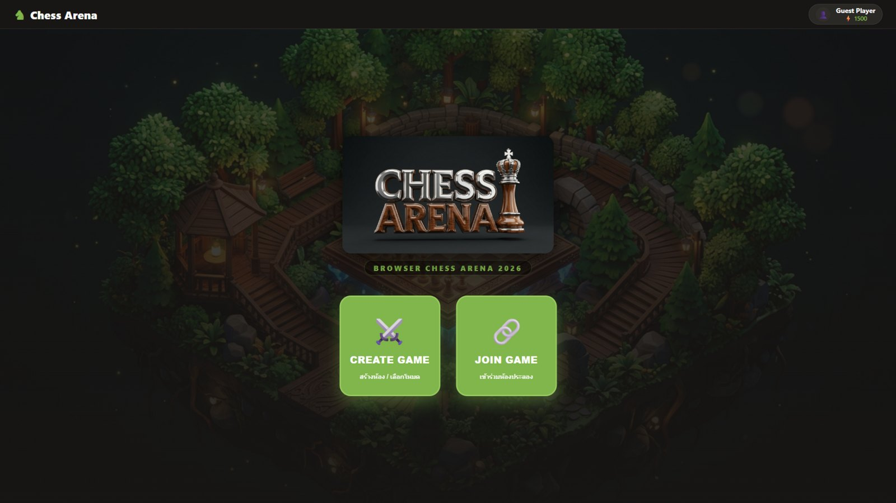
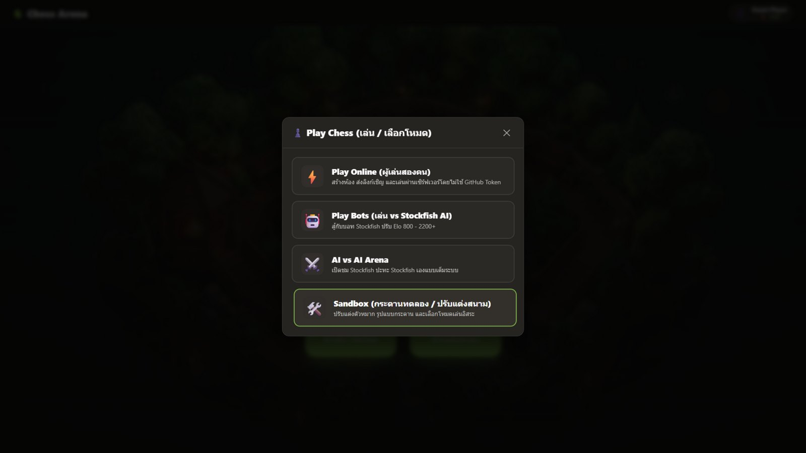
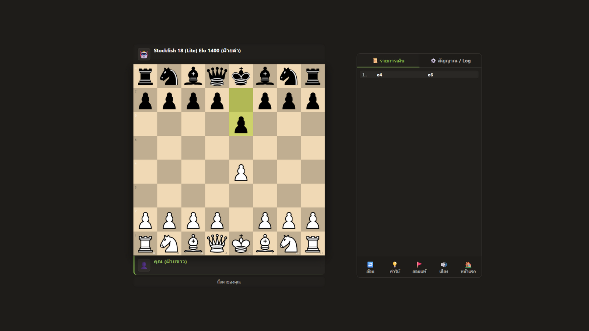

<h1 align="center">♞ Chess Arena</h1>

<p align="center">
  <strong>สนามหมากรุกสากลในเบราว์เซอร์ — เล่นกับ Stockfish 18 หรือประลองกับผู้เล่นจริงแบบ server-authoritative</strong>
</p>

<p align="center">
  <a href="https://github.com/DeepTutorAi/chess-arena/actions/workflows/deploy.yml"></a>
  
  
  
</p>

<p align="center">
  
</p>

---

## ✨ ไฮไลต์

| | |
| --- | --- |
| 🤖 **เล่น vs AI** | Stockfish 18 ตัวจริงในเบราว์เซอร์ ปรับได้ 11 ระดับ (Elo ≈700–2600 วัดจากบอทแข่งกันเอง) พร้อมเวลาคิดแบบ humanized, สมุดเปิดเกมที่คัดแล้ว และเรตติ้งของคุณ |
| ⚔️ **AI vs AI Arena** | เปิดชม Stockfish ปะทะ Stockfish ปรับ Elo แยกแต่ละฝ่าย หยุด/เล่นต่อได้กลางเกม |
| ⚡ **เล่นออนไลน์** | Live Lobby, ห้อง Public/Private, ลิงก์เชิญแยกสิทธิ์, ผู้ชมสด — เซิร์ฟเวอร์ตรวจทุกตาหมาก |
| 💡 **คำใบ้ระดับ GM** | เอนจินแข็งสุดใน build คำนวณแล้ววาดลูกศรชี้ตาเดินบนกระดาน |
| 🛠️ **Sandbox** | จัดกระดานเองได้ทุกหมาก แล้วส่งเข้าโหมดใดก็ได้เพื่อเล่นต่อ |
| ⏱️ **นาฬิกา & AFK** | Bullet ถึง Classical พร้อมระบบตัดสิน AFK ของเซิร์ฟเวอร์ทั้งช่วงเปิดและช่วงไม่จำกัดเวลา |

<p align="center">
  
  &nbsp;
  
</p>

## 🚀 เริ่มใช้งาน

```bash
npm install
npm run dev        # เล่นในเครื่อง (โหมด offline ใช้ได้ทันที)
npm run build      # build ไป dist/
npm test           # domain suite (node --test) + worker suite (vitest + workers pool)
```

Deploy ขึ้น **GitHub Pages** โดย GitHub Actions (`.github/workflows/deploy.yml`) — รันทั้งสองชุดเทส
ก่อน build และ deploy ทุกครั้งที่ push ไป `main`

## 🕹️ โหมดเล่น

<details open>
<summary><b>เล่นกับบอท & AI vs AI</b></summary>

- ระดับ 1–3 สำหรับมือใหม่, 4–6 ผู้เล่นทั่วไป, 7–8 ระดับทัวร์นาเมนต์, 9–11 ระดับกรังด์มาสเตอร์
  (ปรับผ่าน UCI `Skill Level` + จำกัดความลึก/เวลา — เอนจินเป็นตัวจริง 100%)
- นาฬิกาหมากรุกครบทุก time control: 1+0, 1+1, 3+1.5, 5+0, 10+0, 15+0, 30+0 และไม่จำกัดเวลา
- คำใบ้จากบอท GM (ปุ่ม 💡), ย้อนเดิน, ยอมแพ้, กลับกระดาน เสียงประกอบทุกเหตุการณ์
- AI vs AI มีปุ่มหยุด/เล่นต่อ และบันทึกความคิดของเอนจินในหน้า Log

</details>

<details open>
<summary><b>เล่นออนไลน์กับผู้เล่นจริง</b></summary>

1. กด **JOIN GAME** เพื่อเปิด Live Tournament Lobby ที่อ่านรายการห้องสาธารณะจาก Worker จริง
2. ใส่ชื่อ เลือกตราประจำตัว แล้วกด **JOIN** บนโต๊ะที่ว่าง หรือ **WATCH** บนเกมที่กำลังแข่ง
3. กด **CREATE ROOM** เพื่อสร้างห้อง **Public** (ขึ้น Lobby) หรือ **Private** (ลิงก์เท่านั้น)
4. ห้อง Private กด **แชร์** เพื่อคัดลอกลิงก์ผู้เล่น/ผู้ชม — เป็น capability คนละสิทธิ์กัน
   (`#invite=` สำหรับผู้เล่น, `#watch=` สำหรับผู้ชม ใช้ได้ครั้งเดียวสำหรับที่นั่งผู้เล่น)
5. ผู้ชมเห็นกระดานสด นับจำนวนคนดูได้ แต่เดินหมาก/ยอมแพ้/แย่งที่นั่งไม่ได้ — เซิร์ฟเวอร์ปฏิเสธทุกคำสั่ง
6. เข้าห้องเดิมซ้ำได้จาก **Recent / Reconnect** และเกมตัดสิน AFK ให้อัตโนมัติ

</details>

### กติกา AFK ที่เซิร์ฟเวอร์ตัดสิน

- **สองตาแรก (ทุก time control):** 1 นาที = 15 วิ, 3 นาที = 20 วิ, 5 นาที = 25 วิ, 10 นาที = 30 วิ,
  15 นาที = 35 วิ, 30 นาที/ไม่จำกัด = 40 วิ — ไม่เดินภายในเวลาแพ้ทันที
- **โหมดไม่จำกัดเวลา หลังผ่านสองตา:** ออกจากแท็บ, ขาด heartbeat เกิน 30 วิ หรือคิดเกิน 4 นาที
  จะเข้าสู่ countdown 40 วิ — ครั้งแรก/สองกลับมาก็รอด (กรณี inactivity ต้องเดินหมากจริง)
  ครบ 3 ครั้งแพ้ทันที
- เวลา คำเตือน และผลแพ้ชนะ ทั้งหมดคำนวณโดย Worker — เบราว์เซอร์ไม่มีสิทธิ์อ้าง timestamp ตัวเอง

## 🏗️ สถาปัตยกรรม

```
เบราว์เซอร์ (Vite + vanilla JS)          Cloudflare Workers
┌─────────────────────────────┐         ┌──────────────────────────────┐
│ chessground    กระดาน       │  WSS    │ Durable Object ต่อห้อง        │
│ chess.js (client preview)   │◄───────►│  · chess.js ตรวจทุกตา (authoritative)
│ Stockfish 18 WASM (Worker)  │  HTTP   │  · นาฬิกา + AFK + ผลแพ้ชนะ    │
│ นาฬิกา/แสดงผลจาก serverTime │         │ Lobby Registry (SQLite DO)   │
└─────────────────────────────┘         └──────────────────────────────┘
```

- **Capability model:** session/invite/watch token สุ่ม 32 ไบต์ เก็บเป็น SHA-256 digest
  เทียบแบบ constant-time, ลิงก์เชิญผู้เล่นใช้ครั้งเดียว, token ไม่เคยอยู่ใน URL ของ WebSocket
- **Server-authoritative:** ความถูกต้องของตาหมาก นาฬิกา ผลเกม และ AFK ทั้งหมดอยู่ฝั่ง Worker
  client เสนอตา แล้ว commit เฉพาะ snapshot จากเซิร์ฟเวอร์เท่านั้น
- **ป้องกันการล่วงละเมิด:** origin allowlist, จำกัดอัตราสร้างห้องต่อ IP, จำกัดอัตราข้อความต่อ socket,
  เพดานผู้ชม 50 คน, body ไม่เกิน 8 KiB

### โครงสร้างโปรเจกต์

```
public/engine/        เอนจิน Stockfish (js + wasm) — จัดการโดย scripts/copy-engine.mjs
src/controller.js     state machine ของทุกโหมด (กระดาน นาฬิกา เอนจิน ออนไลน์)
src/online.js         client ห้องออนไลน์ (HTTP + WebSocket + validator โปรโตคอล)
src/lobby.js          Live Lobby: การ์ดห้อง ฟิลเตอร์ Join/Watch reconnect
src/ui.js             DOM helper (textContent-first, กัน XSS ตามดีไซน์)
src/clock.js          นาฬิกาหมากรุก drift-free (performance.now)
worker/index.js       router: origin allowlist, rate limit, body cap
worker/room.js        Durable Object ต่อห้อง (hibernatable WebSockets, alarms)
worker/game-state.js  domain ตัดสิน: ตาหมาก นาฬิกา timeout, ผลแพ้ชนะ
worker/afk-state.js   state machine AFK (opening/hidden/heartbeat/inactivity)
worker/lobby-registry.js  Lobby SQLite: keyset pagination, sweep ห้องหมดอายุ
scripts/agent-client.mjs  client ตัวอย่างสำหรับ AI ภายนอก (โปรโตคอล Gist เดิม)
scripts/arena-host.mjs    รันเอนจินสนามจากเทอร์มินัล (ไม่ต้องเปิดแท็บทิ้งไว้)
docs/agent-battle.md      โปรโตคอลการประลองสำหรับ AI คู่แข่ง (legacy)
```

## 🌐 รันระบบออนไลน์ในเครื่อง

```bash
npx wrangler dev --port 8787        # terminal 1 — Worker + Durable Objects
```

```powershell
$env:VITE_ONLINE_API_URL="http://localhost:8787"   # terminal 2
npm run dev
```

> ตัวเลือก deployment: frontend บน GitHub Pages + Worker แยกโดเมน (ตั้ง
> `VITE_ONLINE_API_URL` ตอน build) — หน้า `*.github.io` จะปิดโหมดออนไลน์ให้เอง
> จนกว่าจะตั้งค่านี้ หรือจะ deploy รวม origin เดียวด้วย `npx wrangler deploy`
> (ดูข้อจำกัด wasm ด้านล่าง)

คำสั่งตรวจสอบทั้งหมด:

```bash
npm test                            # ทั้งสองชุดเทส
npm run build                       # production build
npx wrangler deploy --dry-run       # ตรวจ config ของ Worker
```

## ⚠️ ข้อจำกัด deployment ปัจจุบัน

`public/engine/stockfish-18-lite-single.wasm` มีขนาด ~7.3 MB ซึ่งเกินเพดาน static asset
เดี่ยว 5 MB ของ Workers Assets จึงยัง deploy รวมทุกโหมดบน origin เดียวไม่ได้จนกว่าจะย้าย
ไฟล์เอนจินไป object storage/CDN หรือใช้ build ที่เล็กกว่า ระบบ Lobby/Join/Watch ไม่พึ่ง
ไฟล์นี้และทดสอบ deploy แยกได้ — แต่ห้ามถือว่า preview ที่ตัดเอนจินออกพิสูจน์โหมดเล่นกับ AI

## 🤖 ต่อสู้กับ AI ตัวนอก (Legacy Gist protocol)

โปรโตคอล Gist ยังใช้ได้สำหรับ terminal AI clients (ไม่แสดงใน UI ผู้เล่นแล้ว):

```bash
node scripts/arena-host.mjs <gistId> <token> <w|b> [movetimeMs]
```

> GitHub API ไม่คิดค่าใช้จ่าย แต่ poll ถี่จะติด rate limit (60 ครั้ง/ชม. แบบไม่ล็อกอิน)
> แนะนำช่วงห่าง ≥ 2.5 วินาที (ค่าเริ่มต้น) — ดู trust model ทั้งหมดใน `docs/agent-battle.md`

## 🛠️ สคริปต์สร้างข้อมูล (offline — ไม่ต้องรันตอน build)

| คำสั่ง | ทำอะไร |
| --- | --- |
| `npm run openings` | ดึงชื่อแนวเปิดจาก lichess → `public/assets/openings.json` (ใช้ป้ายชื่อและ "Book" ในรีวิว) |
| `npm run botbook` | คัดสมุดเปิดเกมของบอท → `public/assets/botbook.json` ทุกตาถูกเอนจินตรวจแล้ว (ต่างจากตาที่ดีที่สุดไม่เกิน 50 cp) |
| `npm run calibrate -- --games 10 --offset 3 --seed scripts/level-results.json` | Bot Arena: ให้ 11 ระดับแข่งกันเอง แล้วคำนวณ Elo → `src/level-ratings.js` (ผลดิบอยู่ใน `scripts/level-results.json`) |

## 🧪 การทดสอบ

| ชุด | คำสั่ง | ครอบคลุม |
| --- | --- | --- |
| Domain | `npm run test:domain` | นาฬิกา, game state, AFK, โปรโตคอล, validator, lobby/online UI (happy-dom) |
| Worker | `npm run test:worker` | integration จริงบน Durable Objects: origin, invite ใช้ครั้งเดียว, race เข้าห้อง, AFK alarm, throttle, ผู้ชม 50 คน |

CI (GitHub Actions) รันทั้งสองชุดและ build ก่อน deploy ทุกครั้ง

## 📄 License

โค้ดของสนามนี้ MIT — เอนจิน Stockfish ที่รวมมาคือ GPLv3 (ดู `node_modules/stockfish/Copying.txt`),
chess.js MIT, chessground GPLv3
